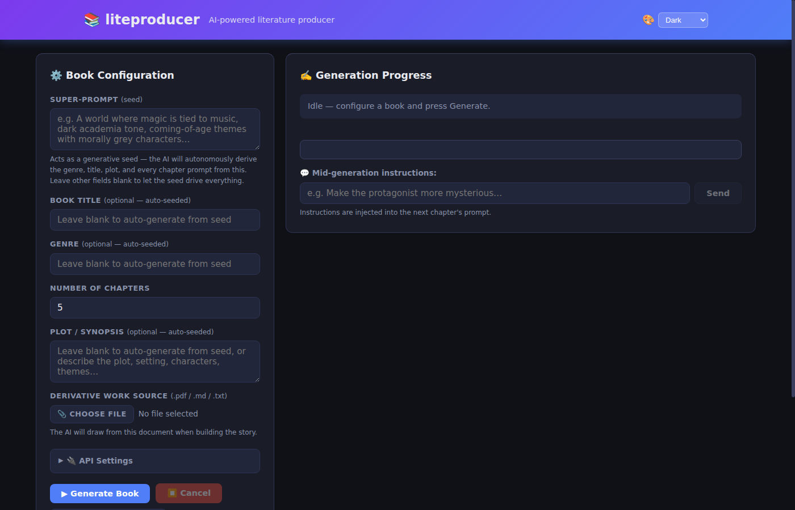
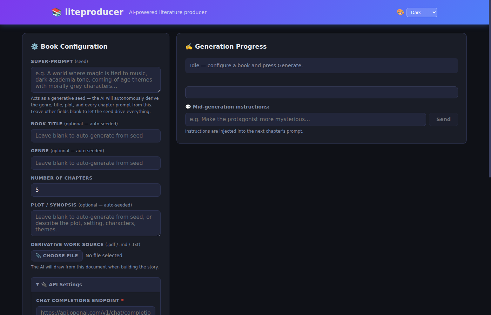
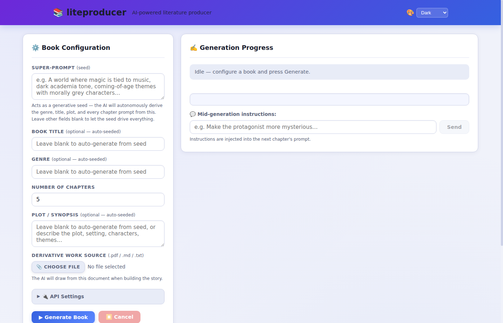
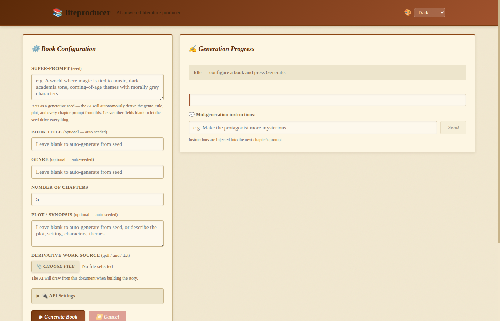
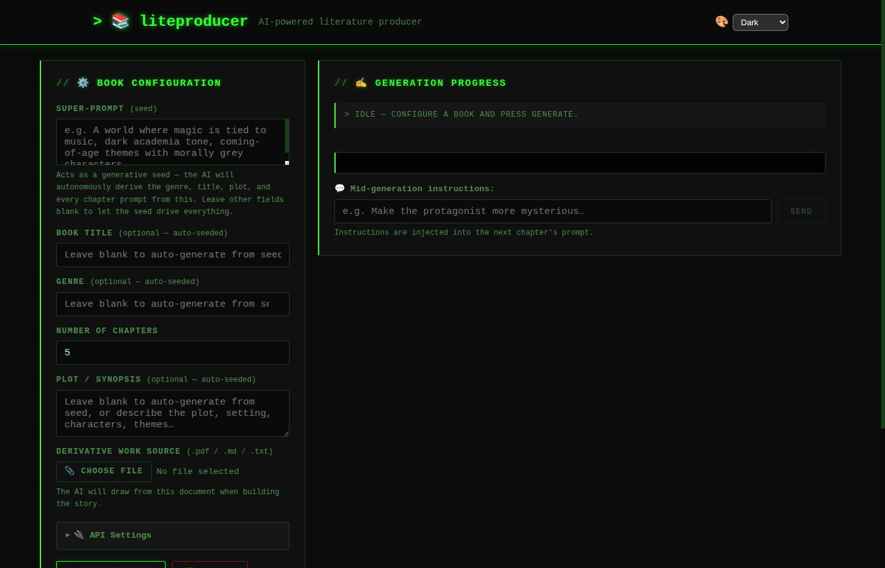

# liteproducer
The very simple, production-ready AI-powered literature producer 📚🤖



<details>
<summary>More screenshots</summary>

**API Settings (system prompt menu)**



**Light theme**



**Sepia theme**



**Terminal theme**



</details>

## Features

- **Dashboard layout** – two-column view keeps book configuration on the left and live generation on the right, so everything is visible at a glance
- **Custom API endpoint** – works with any OpenAI-compatible chat completions API
- **Custom system prompt** – define your own AI persona in the dedicated System Prompt field inside API Settings; the creative seed and derivative source are still appended automatically
- **Super-Prompt seed** – one creative seed autonomously drives genre, title, plot, and every chapter
- **Genre & plot customization** – pick a genre, describe the plot, set the number of chapters
- **Real-time streaming** – watch the story being written token by token in the browser
- **Mid-generation instructions** – send the AI new directions at any time while the book is being written
- **Continuous mode** – automatically start generating a new book as soon as the previous one finishes
- **PDF export** – each completed book is saved as a downloadable `.pdf` file
- **Five themes** – Dark, Light, Sepia, Ocean, Terminal; preference is remembered across sessions

## Quick Start

```bash
# Install dependencies
pip install -r requirements.txt

# Run the server
python app.py
```

Then open **http://localhost:5000** in your browser.

## Usage

1. Open **🔌 API Settings** and enter your **Chat Completions Endpoint** (e.g. `https://api.openai.com/v1/chat/completions`), **API Key**, and **Model** name
2. Optionally write a **System Prompt** to give the AI a custom persona (replaces the default author persona while still honouring the seed)
3. Enter a **Super-Prompt** seed to let the AI autonomously derive genre, title, and plot — or fill those fields manually
4. Set the **Number of Chapters** and an optional **Plot / Synopsis**
5. Click **▶ Generate Book** – the outline and chapters will stream live in the right-hand panel
6. While the book is generating, type instructions in the **Mid-generation instructions** box and click **Send** – they will be incorporated into the next chapter
7. Toggle **🔁 Continuous Mode** to have new books start automatically one after another
8. Download finished books from the **📂 Generated Books** section

Generated PDFs are saved in the `books/` directory.
