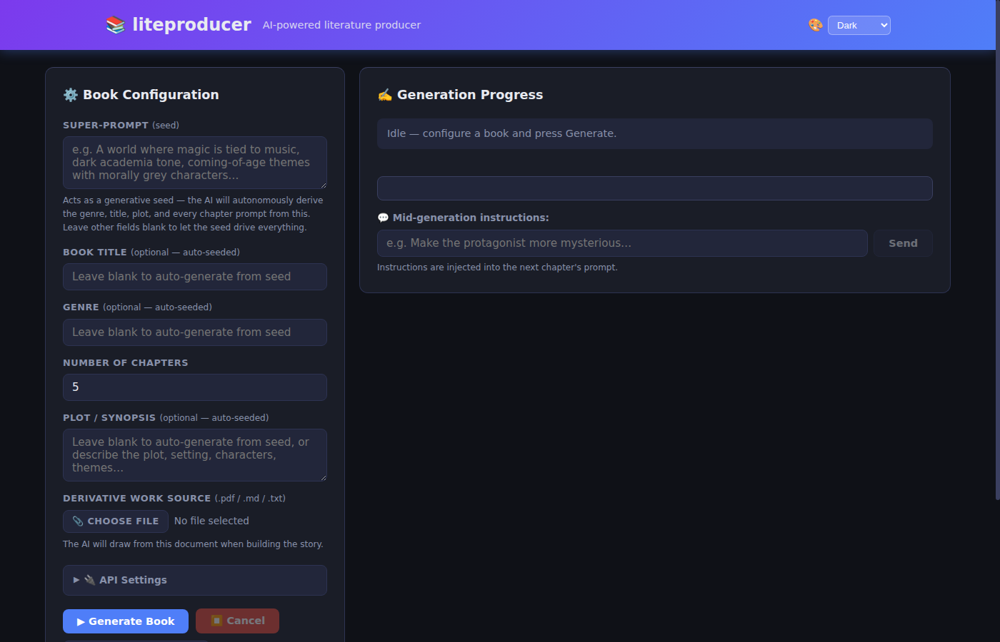
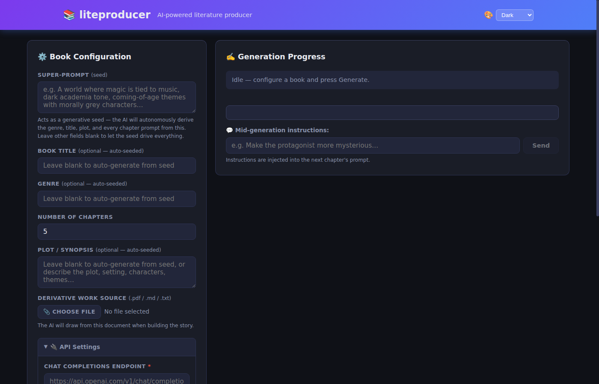
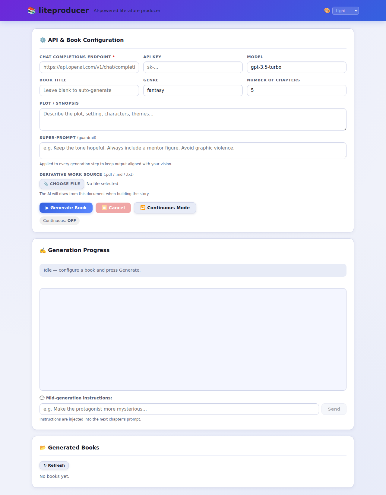
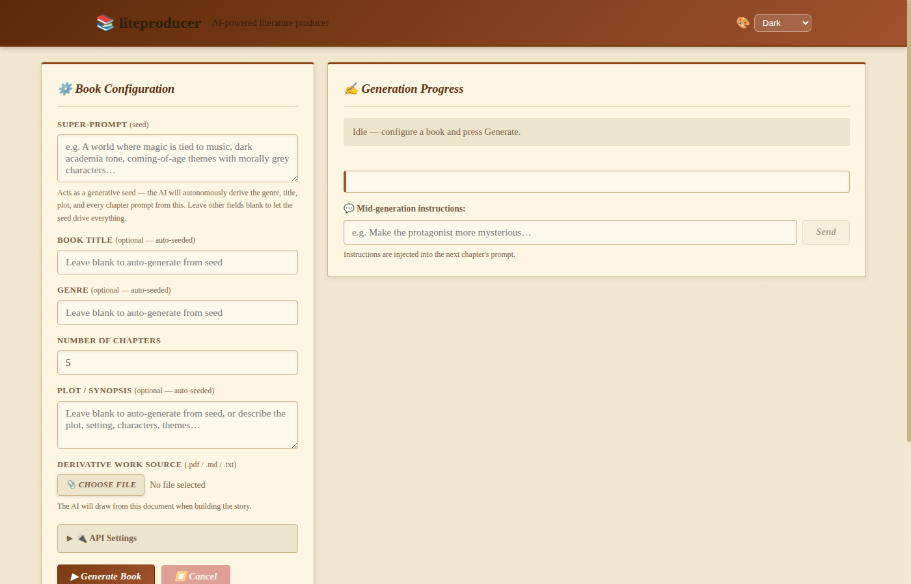
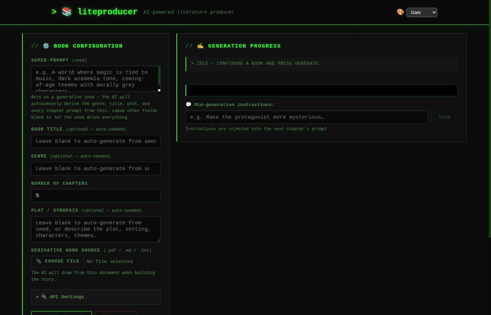

# liteproducer
The very simple, production-ready AI-powered literature producer 📚🤖



<details>
<summary>More screenshots</summary>

**API Settings (system prompt menu)**



**Light theme**



**Sepia theme**



**Terminal theme**



</details>

## Features

- **Dashboard layout** – two-column view keeps book configuration on the left and live generation on the right, so everything is visible at a glance
- **Custom API endpoint** – works with any OpenAI-compatible chat completions API
- **Custom system prompt** – define your own AI persona in the dedicated System Prompt field inside API Settings; the creative seed and derivative source are still appended automatically
- **Super-Prompt seed** – one creative seed autonomously drives genre, title, plot, and every chapter
- **Genre & plot customization** – pick a genre, describe the plot, set the number of chapters
- **Real-time streaming** – watch the story being written token by token in the browser
- **Mid-generation instructions** – send the AI new directions at any time while the book is being written
- **Continuous mode** – automatically start generating a new book as soon as the previous one finishes
- **PDF export** – each completed book is saved as a downloadable `.pdf` file
- **Five themes** – Dark, Light, Sepia, Ocean, Terminal; preference is remembered across sessions

## Installation

### Prerequisites

- **Python 3.10+**
- **pip** (included with Python)
- **Node.js 18+** and **npm** (only required for the PWA / Tauri desktop app)

### Server (Flask)

```bash
# Clone the repository
git clone https://github.com/student338/liteproducer.git
cd liteproducer

# Create and activate a virtual environment (recommended)
python -m venv venv
source venv/bin/activate        # Linux / macOS
# venv\Scripts\activate         # Windows

# Install dependencies
pip install -r requirements.txt

# Run the server
python app.py
```

Then open **http://localhost:5000** in your browser.

### Production Deployment (Docker + Nginx)

```bash
docker compose up --build -d
```

This starts:
- **Gunicorn** serving the Flask app on an internal port
- **Nginx** as a reverse proxy on port **80**, handling static files and proxying API/SSE requests to Gunicorn

Open **http://localhost** to access the application.

### PWA / Desktop App

```bash
cd pwa
npm install
npm run dev        # Vite dev server at http://localhost:1420
```

See the [Desktop & Mobile App](#desktop--mobile-app-pwa--tauri) section below for native builds.

## Usage

1. Open **🔌 API Settings** and enter your **Chat Completions Endpoint** (e.g. `https://api.openai.com/v1/chat/completions`), **API Key**, and **Model** name
2. Optionally write a **System Prompt** to give the AI a custom persona (replaces the default author persona while still honouring the seed)
3. Enter a **Super-Prompt** seed to let the AI autonomously derive genre, title, and plot — or fill those fields manually
4. Set the **Number of Chapters** and an optional **Plot / Synopsis**
5. Click **▶ Generate Book** – the outline and chapters will stream live in the right-hand panel
6. While the book is generating, type instructions in the **Mid-generation instructions** box and click **Send** – they will be incorporated into the next chapter
7. Toggle **🔁 Continuous Mode** to have new books start automatically one after another
8. Download finished books from the **📂 Generated Books** section

Generated PDFs are saved in the `books/` directory.

## Desktop & Mobile App (PWA / Tauri)

liteproducer is also available as a standalone Progressive Web App and native desktop/mobile app via [Tauri](https://tauri.app/). The PWA version lives in the `/pwa` directory and does **not** require the Python server — it calls LLM APIs directly from the client and can even run models locally via WebLLM (WASM).

### Quick Start (PWA dev)

```bash
cd pwa
npm install
npm run dev        # Vite dev server at http://localhost:1420
npm run build      # Production build in pwa/dist/
```

### Native App (Tauri)

```bash
cd pwa
npm install
npm run tauri:dev      # Dev mode with hot-reload
npm run tauri:build    # Build platform installer
```

### Platform Installers

| Platform | Format | Build Command |
|----------|--------|---------------|
| Windows  | `.exe` / `.msi` | `npm run tauri:build` |
| macOS    | `.app` / `.dmg` | `npm run tauri:build` |
| Linux    | `.AppImage` / `.deb` | `npm run tauri:build` |
| Android  | `.apk` | `npm run tauri:android:build` |
| iOS      | `.ipa` | `npm run tauri:ios:build` |

See [`pwa/BUILD.md`](pwa/BUILD.md) for detailed build prerequisites and instructions.

### WebLLM (Local AI via WASM)

The PWA supports running LLM inference entirely on-device using [WebLLM](https://webllm.mlc.ai/):

1. Open **🧠 Local AI (WebLLM)** in the app
2. Select and load a model (downloaded once, cached locally)
3. Generate books without an API key or internet connection

Supported models include Llama 3.1 8B, Mistral 7B, Gemma 2 2B, Phi 3.5 Mini, and TinyLlama 1.1B.
